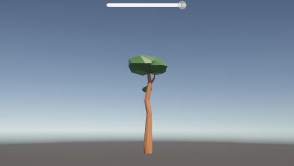

# GLTFUtility-example-use

This project is a basic implementation of a glTF loader for Unity 3D using the [GLTFUtility](https://github.com/Siccity/GLTFUtility) package.

## Features
- Loads glTF file at runtime
- Displays a loading progress bar

## How to Use

1. Clone this repository
2. Open the project in Unity
3. Place your glTF file in the `StreamingAssets` folder
4. Update the `relativeFilePath` field in the `GLTFLoader` script with the relative path to your glTF file (e.g., `MyModel.gltf`)

The provided `GLTFLoader` script loads the glTF file at runtime, updates a progress bar during the load, and instantiates the loaded object in the scene.
